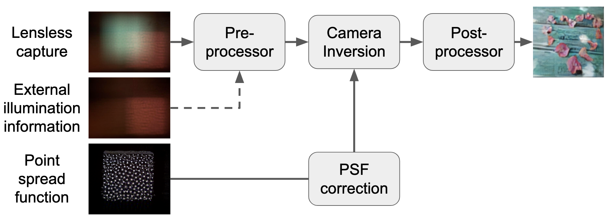

# Training physics-informed reconstruction models

The core PyTorch-based training script can be found [here](https://github.com/LCAV/LenslessPiCam/blob/main/scripts/recon/train_learning_based.py), which is used to train physics-informed reconstruction models on various datasets. The script supports different camera inversion methods, pre- and post-processors, and PSF correction. Below is a visualization of the modular framework that can be trained (all components are optional).



The following datasets are supported (hyperlinks takes to relevant configuration description).
By default, the model architecture uses five unrolleed iterations of ADMM for camera inversion, and UNetRes models for the pre-processor post-processor, and PSF correction.

- [DiffuserCam](#diffusercam)
    - [Transformer architecture for pre- and post-processors](#transformer-architecture-for-pre--and-post-processors)
    - [Multi PSF camera inversion (PhoCoLens)](#multi-psf-camera-inversion)
- [TapeCam](#tapecam)
- [DigiCam with a Single Mask](#digicam-with-a-single-mask)
- [DigiCam with Multiple Masks](#digicam-with-multiple-masks)
- [DigiCam CelebA](#digicam-celeba)
- [MultiLens under External Illumination](#multilens-under-external-illumination)

By commenting/uncommenting relevant sections in the configuration file, you can train models with different architectures or by setting parameters via the command line. 
The corresponding dataset will be downloaded from Hugging Face (if not done already).
The configuration files are based on [Hydra](https://hydra.cc/docs/intro/), which allows for easy parameter management. For more on Hydra, check out this [blog post](https://medium.com/@bezzam/hydra-for-cleaner-python-code-and-better-reproducibility-in-research-c035028101f9).

The output of training can be visualized on WandB (if you have connected with it when launching the script) and will be saved in the `outputs` directory with the appropriate timestamp.

With DiffuserCam, we show how to set different camera inversion methods and neural networks architecture for the processors, which can also be used with other datasets.


## DiffuserCam

- Dataset link: https://huggingface.co/datasets/bezzam/DiffuserCam-Lensless-Mirflickr-Dataset-NORM
- Default configuration: https://github.com/LCAV/LenslessPiCam/blob/main/configs/train/diffusercam.yaml
- WandB report (TCI 2025 paper): https://api.wandb.ai/links/lcav/dpdrs9md

The commands below show how to train different camera inversion methods on the DiffuserCam dataset (downsampled by a factor of 2 along each dimension). For a fair comparison, all models use around 8.1M parameters.

### Unrolled ADMM
With UNetRes models for the pre- and post-processors, and PSF correction.
```bash
# unrolled ADMM
python scripts/recon/train_learning_based.py -cn diffusercam
```

### Compensation branch
Adding compenstation branch to unrolled ADMM to address model mismatch.
```bash
# - adjust shapes of pre and post processors
python scripts/recon/train_learning_based.py -cn diffusercam \
    reconstruction.psf_network=False \
    reconstruction.pre_process.nc=[16,32,64,128] \
    reconstruction.post_process.nc=[16,32,64,128] \
    reconstruction.compensation=[24,64,128,256,400]
```

### Trainable inversion
FlatNet but without adversarial loss.
```bash
# -- need to set PSF as trainable
python scripts/recon/train_learning_based.py -cn diffusercam \
    reconstruction.method=trainable_inv \
    reconstruction.psf_network=False \
    trainable_mask.mask_type=TrainablePSF \
	trainable_mask.L1_strength=False
```

### Multi wiener deconvolution network
Multi wiener deconvolution network (MWDN) with PSF correction. No pre- and post-processors as the network
has layers before and after camera inversion.
```bash
python scripts/recon/train_learning_based.py -cn diffusercam \
    reconstruction.method=multi_wiener \
    reconstruction.multi_wiener.nc=[32,64,128,256,436] \
    reconstruction.pre_process.network=null \
    reconstruction.post_process.network=null \
    reconstruction.psf_network=False
```

### Transformer architecture for pre- and post-processors

The following command shows how to train a camera inversion model with a transformer architecture for the pre- and post-processors. These models uses around 8M parameters.
Note that Transformer models are computationally expensive and require more memory than UNetRes models for training (so the batch size is reduced from 4 to 2).
```bash
 python scripts/recon/train_learning_based.py -cn diffusercam_transformer
```
[This report](https://api.wandb.ai/links/lcav/mtbd9g2c) compares between using UNetRes and Transformer models for the pre- and post-processors.

### Multi PSF camera inversion

Similar to [PhoCoLens](https://phocolens.github.io/), we can train a camera inversion model that learns multiple PSFs. The training below uses the DiffuserCam dataset with its full resolution, and the number of model parameters is around 11.6M.
```bash
python scripts/recon/train_learning_based.py -cn diffusercam \
    reconstruction.method=svdeconvnet \
    reconstruction.pre_process.nc=[32,64,116,128] \
    reconstruction.psf_network=False \
    trainable_mask.mask_type=TrainablePSF \
	trainable_mask.L1_strength=False \
    files.downsample=1 files.downsample_lensed=1
```
[This report](https://wandb.ai/lcav/diffusercam_fullres/reports/Evaluating-SVDeconvNet-on-DiffuserCam-dataset--VmlldzoxMTcxMTg0NA?accessToken=g2p50wn2q1p4xu9ygfjkvak4ybk1gk4tt1aryjb0yx8u2nat3jxmcpnh7uq5x48i) compares this camera inversion approach with the modular (single PSF deconvolution) from above. A pre-processor helps both camera inversion methods to achieve better performance.

## TapeCam

- Dataset link: https://huggingface.co/datasets/bezzam/TapeCam-Mirflickr-25K
- Default configuration: https://github.com/LCAV/LenslessPiCam/blob/main/configs/train/tapecam.yaml
- WandB report (TCI 2025 paper): https://api.wandb.ai/links/lcav/mxi7rgsc

Command to launch TapeCam training with default settings:
```bash
# unrolled ADMM
python scripts/recon/train_learning_based.py -cn tapecam
```

## DigiCam with a Single Mask

- Dataset link: https://huggingface.co/datasets/bezzam/DigiCam-Mirflickr-SingleMask-25K
- Default configuration: https://github.com/LCAV/LenslessPiCam/blob/main/configs/train/digicam.yaml
- WandB report (TCI 2025 paper): https://api.wandb.ai/links/lcav/pubfsfuj

Command to launch DigiCam training (on MirFlickr dataset) training with default settings:
```bash
# unrolled ADMM
python scripts/recon/train_learning_based.py -cn digicam
```

## DigiCam with Multiple Masks

- Dataset link: https://huggingface.co/datasets/bezzam/DigiCam-Mirflickr-MultiMask-25K
- Default configuration: https://github.com/LCAV/LenslessPiCam/blob/main/configs/train/digicam_multimask.yaml
- WandB report (TCI 2025 paper): https://api.wandb.ai/links/lcav/ncx5ib0u

Command to launch DigiCam training (on MirFlickr dataset measured with multiple masks) with default settings:
```bash
# unrolled ADMM
python scripts/recon/train_learning_based.py -cn digicam_multimask
```

## DigiCam CelebA

- Dataset link: https://huggingface.co/datasets/bezzam/DigiCam-CelebA-26K
- Default configuration: https://github.com/LCAV/LenslessPiCam/blob/main/configs/train/digicam_celeba.yaml
- WandB report (TCI 2025 paper): https://api.wandb.ai/links/lcav/334tjw6w

Command to launch DigiCam training (on CelebA dataset) with default settings:
```bash
# unrolled ADMM
python scripts/recon/train_learning_based.py -cn digicam_celeba
```

## MultiLens under External Illumination

- Dataset link: https://huggingface.co/datasets/Lensless/MultiLens-Mirflickr-Ambient
- Default configuration: https://github.com/LCAV/LenslessPiCam/blob/main/configs/train/multilens_ambient.yaml
- WandB report (ICASSP 2025 paper): https://api.wandb.ai/links/lcav/h7astyxi

Command to launch MultiLens training with default settings:
```bash
# unrolled ADMM
python scripts/recon/train_learning_based.py -cn multilens_ambient
```
